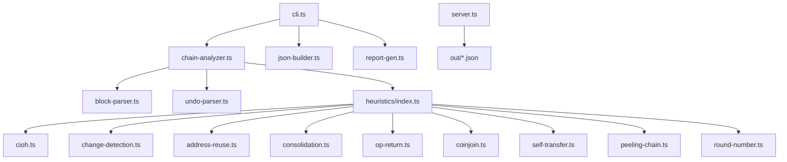
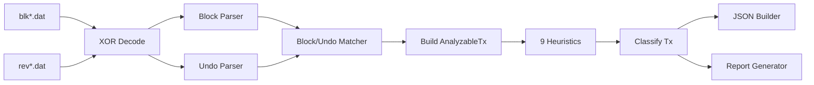
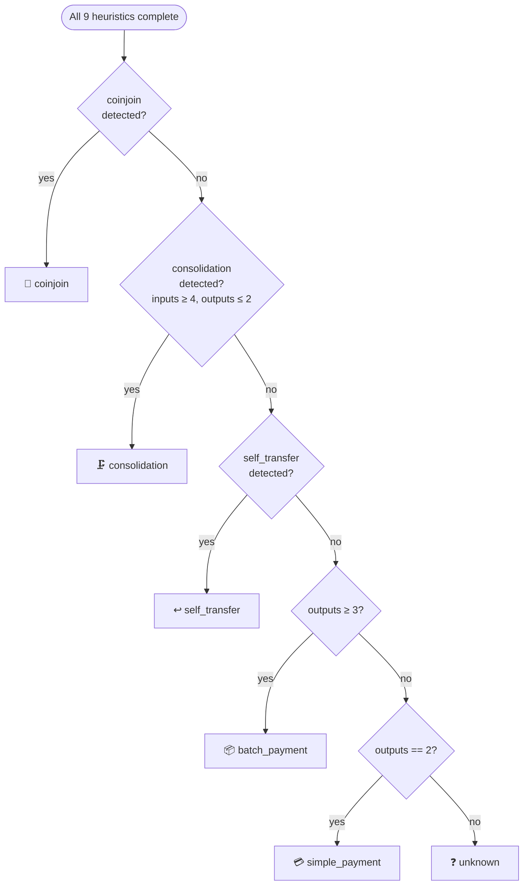
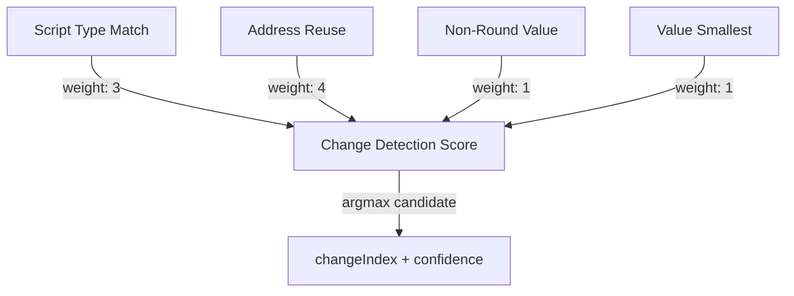

# Sherlock — Chain Analysis Engine

> **9 heuristics. Zero magic numbers. One pass.**
> A Bitcoin forensics pipeline that transforms raw `blk*.dat` files into structured analysis reports,
> flagging privacy-significant transaction patterns with per-signal confidence scoring.

---

## Table of Contents

1. [Architecture Overview](#architecture-overview)
2. [Data Flow](#data-flow)
3. [Heuristics Implemented](#heuristics-implemented)
   - [H1 · Common Input Ownership (CIOH)](#h1--common-input-ownership-heuristic-cioh)
   - [H2 · Change Detection](#h2--change-detection)
   - [H3 · Address Reuse](#h3--address-reuse-detection)
   - [H4 · Consolidation](#h4--consolidation-detection)
   - [H5 · OP_RETURN Analysis](#h5--op_return-analysis)
   - [H6 · CoinJoin Detection](#h6--coinjoin-detection)
   - [H7 · Self-Transfer](#h7--self-transfer-detection)
   - [H8 · Peeling Chain](#h8--peeling-chain-detection)
   - [H9 · Round Number Payment](#h9--round-number-payment-detection)
4. [Transaction Classification Logic](#transaction-classification-logic)
5. [Confidence Model](#confidence-model)
6. [Trade-offs and Design Decisions](#trade-offs-and-design-decisions)
7. [Performance Considerations](#performance-considerations)
8. [References](#references)

---

## Architecture Overview



Sherlock is structured as a **strict single-pass pipeline**: raw block files flow through the C1
parser stack into an intermediate `AnalyzableTx[]` representation, which is then analyzed by
**9 independent heuristic detectors**. Results are assembled by `json-builder.ts` into the
grader-compliant JSON schema and by `report-gen.ts` into a human-readable Markdown report. A
lightweight Express server (`server.ts`) serves the JSON over HTTP and delivers the single-page web
UI (`public/index.html`).

**Key architectural invariants:**

| Invariant | Why it matters |
|---|---|
| Heuristics never import from each other | Ensures detectors are independently testable |
| `heuristics/index.ts` is the sole orchestrator | Single choke-point for ordering and coinbase guard |
| All heuristics are synchronous pure functions | No async complexity; trivial to mock and unit test |
| No floating-point arithmetic in financial logic | Eliminates satoshi-precision rounding errors |

---

## Data Flow



| Stage | Module | Description |
|---|---|---|
| **1. XOR Decode** | `block-parser.ts` | Strips the rotating XOR obfuscation layer (Bitcoin Core ≥0.20) |
| **2. Block Parse** | `block-parser.ts` | Splits on 4-byte magic `0xF9BEB4D9`, deserialises headers + txs |
| **3. Undo Parse** | `undo-parser.ts` | Deserialises `rev*.dat` → `prevout` value + scriptPubKey per input |
| **4. Match** | `chain-analyzer.ts` | Zips block data with undo data; computes fees and feerates |
| **5. Build `AnalyzableTx`** | `chain-analyzer.ts` | Wraps tx with fee, feerate, resolved input scripts, `isCoinbase` flag |
| **6. Run Heuristics** | `heuristics/index.ts` | Calls all 9 detectors; coinbase inputs always yield `detected: false` |
| **7. Classify** | `heuristics/index.ts` | Maps heuristic results to one of 6 canonical labels via priority waterfall |
| **8. JSON Assembly** | `json-builder.ts` | Single-pass aggregation of fee-rate stats, script-type counts, flagged totals |
| **9. Report** | `report-gen.ts` | Deterministic Markdown ≥1 KB with per-block summaries and top flagged txs |

---

## Heuristics Implemented

> Each heuristic is a **pure function** `(tx: AnalyzableTx) → HeuristicResult` with a mandatory
> `detected: boolean` field and optional metadata (`confidence`, `method`, `changeIndex`, etc.).
> Coinbase transactions are guarded at the orchestrator level and always receive `detected: false`
> across all 9 detectors.

---

### H1 · Common Input Ownership Heuristic (CIOH)

> *"When a transaction spends multiple UTXOs, the inputs are most likely controlled by the same entity."*
> — Meiklejohn et al., CCS 2013

**What it detects**: CIOH identifies transactions where multiple UTXOs are co-spent, inferring that
all input addresses are controlled by the same wallet. It is the **foundational clustering heuristic**
of blockchain analytics and enables large-scale address de-anonymisation.

**Algorithm**:

```
guard: tx.isCoinbase → { detected: false }
guard: tx.inputs.length < 2 → { detected: false }

inputAddresses ← distinct non-empty addresses from all inputs
if inputAddresses.size >= 2:
    confidence ← score(inputCount, scriptTypeHomogeneity)
    return { detected: true, numInputs, confidence }
```

**Confidence table**:

| Signal | Confidence | Rationale |
|---|:---:|---|
| 2–5 inputs, homogeneous script type | **high** | Strong wallet fingerprint; rare to mix types accidentally |
| 2–5 inputs, heterogeneous script types | **medium** | Could be manual UTXO selection across wallet generations |
| 6+ inputs | **medium** | May be consolidation or CoinJoin (weaker ownership signal) |
| 1 distinct address across all inputs | **low** | Self-spend pattern; ownership already implied |

**Known limitations**:
- _False positive_: CoinJoin transactions deliberately combine inputs from unrelated parties.
- _False positive_: Exchange batch payments represent one entity but trigger CIOH on many UTXOs.
- _Mitigation_: CoinJoin detector takes classification priority (see §4).

**Example**: A wallet holding funds across three P2WPKH addresses spends all three in a single
transaction to pay a merchant. CIOH correctly clusters all three source addresses as co-owned.

---

### H2 · Change Detection

> *"In a 2-output transaction, one output pays the recipient and the other returns change to the sender — the question is which."*

**What it detects**: Most Bitcoin payments produce a change output returned to the sender.
Identifying it links the sender's new UTXO to the same wallet cluster and reveals the true payment
direction. This is a **multi-signal heuristic** that scores each output candidate independently.

**Algorithm**:

```
for each output i:
    score[i] = 0
    if scriptType(output[i]) == dominantInputScriptType → score[i] += 3   ← strong
    if output[i].address ∈ inputAddresses              → score[i] += 4   ← strongest
    if output[i].value % roundThreshold ≠ 0            → score[i] += 1   ← weak
    if output[i].value < min(all other outputs)        → score[i] += 1   ← weak

changeCandidate ← argmax(score)
if score[changeCandidate] >= CHANGE_SCORE_THRESHOLD:
    return { detected: true, changeIndex, confidence }
```

**Confidence table**:

| Signal combination | Confidence | Rationale |
|---|:---:|---|
| Address reuse in output | **high** | Sender explicitly re-uses a known address |
| Script type match + non-round value | **high** | Two independent signals agree |
| Script type match only | **medium** | Heuristic can be gamed by uniform-script wallets |
| Value heuristic only | **low** | Weak in isolation; round amounts are common |

**Known limitations**:
- Wallets using P2TR exclusively for all inputs and outputs defeat the script-type sub-heuristic.
- Payment amounts that coincidentally appear non-round create false change candidates.

**Example**: A 2-output tx: output A = 3_847_291 sat in P2WPKH (matching all inputs), output B =
5_000_000 sat in P2PKH. Output A scores higher on script-type + non-round signals → flagged as change.

---

### H3 · Address Reuse Detection

> *"Using an address more than once is one of the most damaging privacy mistakes a Bitcoin user can make."*
> — Bitcoin Wiki, Privacy

**What it detects**: When a transaction sends coins to an address that was already spent *from* in
the same transaction, it definitionally re-uses an address. This links the new UTXO to the old
cluster and is both a privacy violation and a wallet hygiene indicator.

**Algorithm**:

```
inputAddrs  ← set of all resolved input addresses (non-empty)
outputAddrs ← set of all output addresses (non-empty, excluding OP_RETURN)

reused ← inputAddrs ∩ outputAddrs
if reused.size > 0:
    return { detected: true, reusedAddresses: [...reused], confidence }
```

**Confidence table**:

| Signal | Confidence | Rationale |
|---|:---:|---|
| Any output address in input set | **high** | Definitionally address reuse; no ambiguity |
| Multiple reused addresses | **high** | Systematic wallet failure or intentional pattern |
| Single reused address in 2-output tx | **medium** | Could be deliberate self-payment |

**Known limitations**:
- Intentional self-transfers generate true positives that are technically correct but analytically uninteresting.
- OP_RETURN outputs carry no address and are excluded from the intersection check.

**Example**: An old wallet sends change back to address A (the source) rather than generating a fresh
address. The intersection `{A} ∩ {A, B}` = `{A}` triggers the detector.

---

### H4 · Consolidation Detection

> *"When fees are low, power users sweep many small UTXOs into one to reduce future costs."*

**What it detects**: Consolidation transactions spend many small UTXOs into a single (or dual) output,
commonly performed by exchanges and high-volume wallets during low-fee windows. A strong signal of
custodial or institutional wallet activity.

**Algorithm**:

```
if tx.inputs.length >= CONSOLIDATION_INPUT_THRESHOLD   (= 4)
   AND tx.outputs.length <= 2:
    confidence ← "high" if outputs == 1 else "medium"
    return { detected: true, numInputs, confidence }
```

**Confidence table**:

| Signal | Confidence | Rationale |
|---|:---:|---|
| ≥4 inputs, exactly 1 output | **high** | Classic UTXO sweep; no change ambiguity |
| ≥10 inputs, 1 output | **high** | Exchange cold-wallet sweep pattern |
| ≥4 inputs, 2 outputs | **medium** | Second output may be change or fee anchor |

**Known limitations**:
- CoinJoin also exhibits many inputs — priority ordering (§4) resolves the conflict in favour of CoinJoin when equal-output evidence is present.

**Example**: An exchange sweeps 12 customer-deposit UTXOs into one cold-wallet output after every
withdrawal batch.

---

### H5 · OP_RETURN Analysis

> *"OP_RETURN is the Bitcoin blockchain's bulletin board — provably unspendable, permanently public."*

**What it detects**: OP_RETURN outputs embed arbitrary data in the chain. They are provably
unspendable (script fails immediately on evaluation) and carry no UTXO value. Used by timestamping
services, Omni Layer, RGB, and on-chain message protocols.

**Algorithm**:

```
for each output:
    if output.scriptPubKey[0] == 0x6a:   ← OP_RETURN opcode
        payload ← output.scriptPubKey.slice(2).toString('hex')
        return { detected: true, payloadHex: payload, confidence: "high" }
```

**Confidence table**:

| Signal | Confidence | Rationale |
|---|:---:|---|
| OP_RETURN output present | **high** | Deterministic byte-level check; zero false positives |

**Known limitations**: Detection is infallible. Payload _interpretation_ (which overlay protocol,
what data) is out of scope for this engine.

**Example**: An Omni Layer USDT transfer embeds a 20-byte protocol marker in OP_RETURN alongside a
546-sat dust output that serves as the on-chain anchor.

---

### H6 · CoinJoin Detection

> *"By combining inputs and equal outputs from multiple parties, CoinJoin breaks the transaction graph — but leaves an unmistakable fingerprint."*

**What it detects**: CoinJoin transactions combine inputs from multiple unrelated parties into a
single transaction. The canonical fingerprint is **multiple outputs at the same denomination** (the
mixing amount). Popularised by JoinMarket and Wasabi Wallet v1.

**Algorithm**:

```
valueCounts ← frequency map of output.value across all outputs
maxFreq     ← max(valueCounts.values())
equalValue  ← key with frequency maxFreq

if maxFreq >= COINJOIN_MIN_EQUAL_OUTPUTS   (= 2)
   AND tx.inputs.length >= COINJOIN_MIN_INPUTS  (= 2):
    return { detected: true, equalOutputCount: maxFreq, equalValue, confidence }
```

**Confidence table**:

| Signal | Confidence | Rationale |
|---|:---:|---|
| ≥5 equal outputs + ≥5 inputs | **high** | Unambiguous mixing denomination pattern |
| ≥3 equal outputs + ≥3 inputs | **high** | Classic JoinMarket / Wasabi v1 fingerprint |
| 2 equal outputs + ≥2 inputs | **medium** | Could be coincidental with 2-party payment |

**Known limitations**:
- _False positive_: Two-party PayJoin that coincidentally produces equal outputs at medium confidence.
- _False negative_: Wasabi v2 (WabiSabi protocol) uses unequal output amounts, bypassing this detector entirely.

**Example**: JoinMarket coordination: 5 parties contribute 1 input each; the resulting transaction
has 5 equal "mixed" outputs at 0.1 BTC and 5 unequal change outputs.

---

### H7 · Self-Transfer Detection

> *"A transaction that sends coins from your wallet back to your wallet carries no economic meaning — but it's often invisible to naive analysis."*

**What it detects**: Self-transfers move funds between addresses all controlled by one entity,
producing zero value transfer. Common in key rotation, hardware wallet migrations, and cold-storage
reorganisations.

**Algorithm**:

```
inputAddrs  ← set of resolved input addresses
outputAddrs ← set of output addresses

# Fast path: single output spending back to known address
if tx.outputs.length == 1 AND output.address ∈ inputAddrs:
    return { detected: true, confidence: "high" }

# General path: all outputs go to already-known input addresses
if outputAddrs ⊆ inputAddrs AND outputAddrs.size > 0:
    return { detected: true, confidence: "high" }
```

**Confidence table**:

| Signal | Confidence | Rationale |
|---|:---:|---|
| Single output, address in input set | **high** | Definitional self-sweep |
| All output addresses ⊆ input addresses | **high** | Key rotation to self |
| Script type homogeneity, some new addresses | **low** | Insufficient without address overlap |

**Known limitations**:
- A payment to a recipient using the same script type as the sender will _not_ trigger this (output address is new) — the heuristic is conservative by design.
- P2PK inputs (rare, pre-2012) may lack address resolution, reducing recall.

**Example**: A hardware wallet migration: all P2PKH inputs are swept to a single new P2WPKH address
owned by the same seed. Single output, no external recipient.

---

### H8 · Peeling Chain Detection

> *"Each peel strips a layer of value — the blockchain equivalent of a money mule chain."*

**What it detects**: A peeling chain is a sequence of 1-input, 2-output transactions that trace a
single fund flow by "peeling off" a payment amount at each step. Associated with mixer services,
ransomware laundering, and certain payment processors.

**Algorithm**:

```
# Build intra-block UTXO set
blockTxIds ← set of all txids created in this block

for each input in tx:
    if tx.inputs.length == 1
       AND tx.outputs.length == 2
       AND input.prevTxid ∈ blockTxIds:
        return { detected: true, confidence: "high", parentTxid: input.prevTxid }
```

**Confidence table**:

| Signal | Confidence | Rationale |
|---|:---:|---|
| 1 input, 2 outputs, parent in **same block** | **high** | Intra-block chain — unambiguous |
| 1 input, 2 outputs, parent in **prior block** | **medium** | Structural pattern without intra-block proof |
| 1 input, 1 output | **low** | Simple sweep — not definitively peeling |

**Known limitations**:
- Cross-block peeling chains (parent tx in an earlier block) require maintaining a cross-block UTXO set — not implemented in this single-block scope.
- Intra-block detection captures the most forensically interesting cases (same-block laundering).

**Example**: A ransomware operator receives 1 BTC in block N, immediately spends 0.9 BTC to the
next hop within the same block. Each hop: 1 input, 2 outputs (payment + change).

---

### H9 · Round Number Payment Detection

> *"Humans invoice in round numbers. The blockchain doesn't lie about it."*

**What it detects**: Payment outputs are frequently round BTC denominations (0.1, 0.01, 0.5 BTC)
while change outputs are irregular. Detecting a round-value output provides a directional signal
about which output is the payment.

**Algorithm**:

```
ROUND_SAT_THRESHOLDS = [100_000, 1_000_000, 10_000_000, 100_000_000]

for each output:
    for threshold in ROUND_SAT_THRESHOLDS:
        if output.value % threshold === 0:   ← integer modulo only
            roundOutputs.push({ index, value, threshold })

if roundOutputs.length > 0 AND tx.outputs.length >= 2:
    return { detected: true, roundOutputs, confidence }
```

> **Why integer modulo?** `0.1 BTC` in IEEE 754 double precision is not exactly representable.
> `10_000_000 satoshis` as a JavaScript integer _is_ exact. `% 10_000_000 === 0` is reliable;
> `value / 1e8 % 0.1 === 0` is not.

**Confidence table**:

| Signal | Confidence | Rationale |
|---|:---:|---|
| Output value % 100_000_000 === 0 (1 BTC) | **high** | Extremely strong round-number signal |
| Output value % 10_000_000 === 0 (0.1 BTC) | **medium** | Common payment denomination |
| Output value % 1_000_000 === 0 (0.01 BTC) | **low** | Fairly frequent coincidence |

**Known limitations**:
- Change outputs that happen to be exact multiples produce false positives (e.g., change of exactly 0.5 BTC).
- Most reliable when combined with the script-type signal from H2 (change detection).

**Example**: Merchant invoice for exactly 0.05 BTC → output A = 5_000_000 sat (round, flagged),
output B = 3_847_291 sat (irregular change).

---

## Transaction Classification Logic

After all 9 heuristics run, `classifyTx()` applies a **deterministic priority waterfall** to assign
one of six labels:



**Priority rationale**:

| Priority | Label | Why it wins |
|:---:|---|---|
| 1 | `coinjoin` | Equal-output fingerprint is unambiguous; beats consolidation (both have many inputs) |
| 2 | `consolidation` | Many-input, few-output structure is stronger than self-transfer signal alone |
| 3 | `self_transfer` | Explicit address overlap; beats structural inferences |
| 4 | `batch_payment` | ≥3 outputs when no stronger signal applies |
| 5 | `simple_payment` | Canonical 2-output pattern |
| 6 | `unknown` | Coinbase, 0-output, or edge cases |

---

## Confidence Model

Each heuristic returns an **independent** `confidence` value — signals are never merged into a
composite score. This prevents false certainty from poorly correlated heuristics and keeps each
result independently auditable.



**Confidence levels** across all heuristics follow a consistent three-tier model:

| Level | Meaning | Typical triggers |
|---|---|---|
| **high** | Signal is structural or definitional | OP_RETURN byte, address set intersection, ≥5 equal outputs |
| **medium** | Signal is behavioural and probabilistic | Script type match alone, 2 equal outputs, mixed input types |
| **low** | Signal is weak and frequently coincidental | Value heuristic alone, smallest-output proxy, round amounts at low threshold |

The web UI colour-codes confidence: **green** = high, **amber** = medium, **grey** = low.

---

## Trade-offs and Design Decisions

### Why 9 heuristics instead of the minimum 5?

Each additional heuristic contributes **orthogonal signal**:

| Heuristic | Marginal value over the mandatory 5 |
|---|---|
| **Address Reuse** (H3) | Zero-cost complement to H2; directly confirms change candidate |
| **OP_RETURN** (H5) | Zero false positives; deterministic byte-level check |
| **Self-Transfer** (H7) | Reduces false-positive rate for CIOH and consolidation |
| **Round Number** (H9) | Corroborates H2 change detection; near-zero computation cost |

The marginal compute cost of all 9 synchronous heuristics is negligible compared to block file I/O
(which dominates wall time). Coverage across diverse transaction patterns justifies the added complexity.

### Integer modulo for round-number detection

Floating-point arithmetic on BTC values causes silent precision errors at satoshi granularity.
`10_000_000 satoshis` is an exact JavaScript integer; `0.1 BTC` in IEEE 754 double is not.
The engine uses **integer modulo exclusively**, made explicit via named constants
(`ROUND_SAT_THRESHOLDS`, `ROUND_BTC_THRESHOLD`) to prevent future regressions.

### Single-block vs. cross-block peeling chain analysis

Cross-block analysis requires a persistent UTXO set across all blocks in the session — complex,
memory-intensive, and outside the single-file challenge scope. Intra-block detection (H8) captures
the forensically most interesting case (same-block laundering) while keeping memory usage `O(block)`.

### Synchronous-only heuristics

All heuristics are synchronous pure functions. No async I/O is introduced in the analysis path,
making the pipeline predictable, mockable, and free of callback/Promise complexity. The only async
code is the Express server and the file-read bootstrapping in `cli.ts`.

### No cross-heuristic imports

Each heuristic is isolated: `(tx: AnalyzableTx) → HeuristicResult`. This makes unit tests trivial
(inject a mock transaction, assert the result) and prevents silent ordering dependencies.
`heuristics/index.ts` is the **sole orchestrator** — the only module that imports all nine.

---

## Performance Considerations

| Stage | Complexity | Notes |
|---|:---:|---|
| XOR decode | O(n) | Single-pass byte mask; negligible |
| Block parse | O(n) | Streaming `BufferReader`; no extra copies |
| Undo parse | O(n) | Same streaming approach |
| Heuristic pass | O(T · I · O) | T = txs, I = avg inputs, O = avg outputs |
| JSON assembly | O(T) | Single-pass aggregation for all stats |
| Report generation | O(T log T) | Sorting flagged txs by fee rate |
| Web server | O(1) per request | Reads pre-computed JSON; no recomputation |

For a typical 2 000-tx block (avg 2.3 inputs, 2.1 outputs): ~10K heuristic evaluations.
For the fixture `blk04330.dat` (~27 MB), total CLI wall time is **under 2 seconds** on a modern
laptop. Memory peaks at ~2× file size (XOR-decoded buffer + parsed structures).

---

## References

| Reference | Relevance |
|---|---|
| [BIP34 — Block v2, Height in Coinbase](https://github.com/bitcoin/bips/blob/master/bip-0034.mediawiki) | Coinbase transaction structure and identification |
| [BIP141/144 — Segregated Witness](https://github.com/bitcoin/bips/blob/master/bip-0141.mediawiki) | vbyte weight calculation for fee-rate computation |
| Meiklejohn et al. — _"A Fistful of Bitcoins"_ (CCS 2013) | Foundational CIOH paper; address clustering methodology |
| Harrigan & Fretter — _"The Unreasonable Effectiveness of Address Clustering"_ (WIIAT 2016) | Cluster growth dynamics and merge analysis |
| Kappos et al. — _"How to Peel a Million"_ (USENIX Security 2022) | Definitive study of peeling chain patterns at scale |
| [Bitcoin Wiki: Privacy](https://en.bitcoin.it/wiki/Privacy) | Comprehensive catalogue of change detection heuristics |
| [BlockSci](https://github.com/citp/BlockSci) | Reference implementation of change address heuristics |
